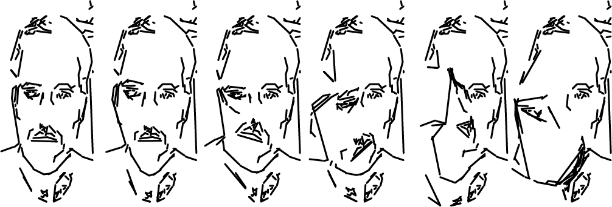

Quick (and dirty) project that process the face and export a PDF to print in AxiDraw.

1) Take the picture with "Capture" button.
2) Adjust the canny edge detection threshold's
	- You can also adjust the Proximity Factor of the Contour Finder ,to get a vertexless shape.
3) With "Process" button you get the PDF (exported in the Output folder)

You can adjust all the parameters when you have the picture, and see the diferences before export :)

**External Libraries**
(you can download from "Add Library" option in Processing)

OpenCV - https://github.com/atduskgreg/opencv-processing
ControlP5 - http://www.sojamo.de/libraries/controlP5/
